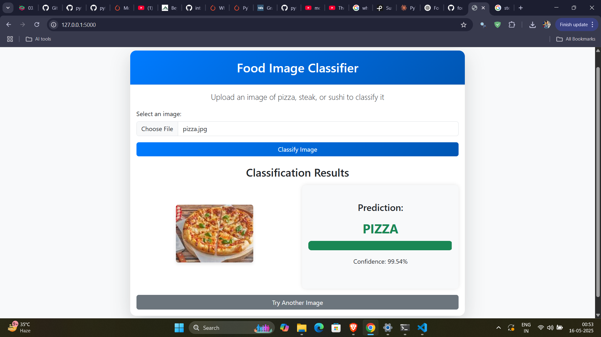

# 🍕 Food-Vision: Deep Learning Food Classifier with Web Interface

[](https://www.python.org/downloads/)
[](https://pytorch.org/)
[](https://flask.palletsprojects.com/)
[](https://opensource.org/licenses/MIT)

A deep learning-powered web application that accurately classifies food images as pizza, steak, or sushi using a custom CNN architecture trained on the Food-101 dataset.



## Project Overview

Food-Vision showcases end-to-end machine learning deployment, from dataset preparation and model training to production-ready web application development. The project demonstrates expertise in:

- **Computer Vision**: Image preprocessing and classification using PyTorch
- **Deep Learning**: Custom CNN architecture design and optimization
- **Web Development**: Full-stack deployment with Flask and modern frontend

The model achieves ~80% accuracy on the test set after extensive experimentation with different architectures and hyperparameters.

## Technical Architecture

### Data Preparation
- Extracted relevant classes (pizza, steak, sushi) from the Food-101 dataset
- Implemented data augmentation techniques:
  - Random horizontal flips
  - Random rotations
  - Color jitter for brightness, contrast, and saturation
- Resized images to 64×64 pixels and normalized pixel values

### Model Architecture
Custom implementation of a TinyVGG-inspired CNN with:
- Two convolutional blocks with BatchNorm, ReLU, and Dropout
- Each block contains two convolutional layers followed by MaxPooling
- Regularization techniques to prevent overfitting
- Final classifier with linear layer

```python
class TinyVGG_Model7(nn.Module):
    def __init__(self, input_shape, hidden_units, output_shape):
        super().__init__()
        self.conv_block_1 = nn.Sequential(
            nn.Conv2d(input_shape, hidden_units, 3, padding=1),
            nn.BatchNorm2d(hidden_units),
            nn.ReLU(),
            nn.Conv2d(hidden_units, hidden_units, 3, padding=1),
            nn.BatchNorm2d(hidden_units),
            nn.ReLU(),
            nn.MaxPool2d(2),
            nn.Dropout(0.3)
        )
        self.conv_block_2 = nn.Sequential(
            nn.Conv2d(hidden_units, hidden_units, 3, padding=1),
            nn.BatchNorm2d(hidden_units),
            nn.ReLU(),
            nn.Conv2d(hidden_units, hidden_units, 3, padding=1),
            nn.BatchNorm2d(hidden_units),
            nn.ReLU(),
            nn.MaxPool2d(2),
            nn.Dropout(0.3)
        )
        self.classifier = nn.Sequential(
            nn.Flatten(),
            nn.Linear(hidden_units * 16 * 16, output_shape)
        )
    
    def forward(self, x):
        x = self.conv_block_1(x)
        x = self.conv_block_2(x)
        return self.classifier(x)
```

### Training Process
- Implemented a robust training loop with validation
- Used Adam optimizer with weight decay for regularization
- Applied learning rate scheduling to improve convergence
- Trained for 30 epochs with early stopping monitoring
- Achieved ~80% accuracy on the test set

### Web Application
- **Backend**: Flask server handling image uploads and inference
- **Frontend**: Responsive UI built with Bootstrap and custom CSS
- **Features**:
  - Clean and intuitive user interface
  - Real-time image classification
  - Confidence score visualization
  - Error handling and validation
  - Mobile-responsive design

## Project Structure

```
food_classifier/
├── app.py                # Main Flask application
├── utils.py              # Helper functions for model prediction
├── requirements.txt      # Project dependencies
├── static/               # Static files (CSS, JS, etc.)
│   ├── css/
│   │   └── style.css     # Custom CSS styles
│   └── uploads/          # Directory to store uploaded images
├── templates/            # HTML templates
│   └── index.html        # Main page template
├── model/                # Directory for the trained model
│   └── food_03.pth       # Trained PyTorch model
└── notebook/             # Jupyter notebooks for model development
    └── food_model.ipynb  # Model training and experimentation
```

## Installation and Usage

### Prerequisites
- Python 3.9+
- Git
- Anaconda or Miniconda (recommended)

### Setup
1. **Clone the repository**
   ```bash
   git clone https://github.com/Pranshulx26/food-classifier-webapp.git
   cd food-classifier-webapp
   ```

2. **Create and activate a conda environment**
   ```bash
   conda create -n food-classifier python=3.9
   conda activate food-classifier
   ```

3. **Install dependencies**
   ```bash
   pip install -r requirements.txt
   ```

### Running the Application
1. **Ensure the model file is in place**
   - The trained model file `food_03.pth` should be in the `model/` directory

2. **Start the Flask server**
   ```bash
   python app.py
   ```

3. **Access the web interface**
   - Open your browser and navigate to `http://127.0.0.1:5000/`
   - Upload an image of pizza, steak, or sushi
   - View the classification results with confidence scores

## Future Improvements
- Expand to more food categories
- Deploy to cloud platforms (AWS, GCP, Azure)
- Implement user accounts to save classification history
- Add mobile application support with React Native
- Integrate with nutrition APIs for detailed food information

## License
This project is licensed under the MIT License - see the LICENSE file for details.

## Acknowledgements
- Food-101 dataset: [https://data.vision.ee.ethz.ch/cvl/datasets_extra/food-101/](https://data.vision.ee.ethz.ch/cvl/datasets_extra/food-101/)
- PyTorch: [https://pytorch.org/](https://pytorch.org/)
- Flask: [https://flask.palletsprojects.com/](https://flask.palletsprojects.com/)
