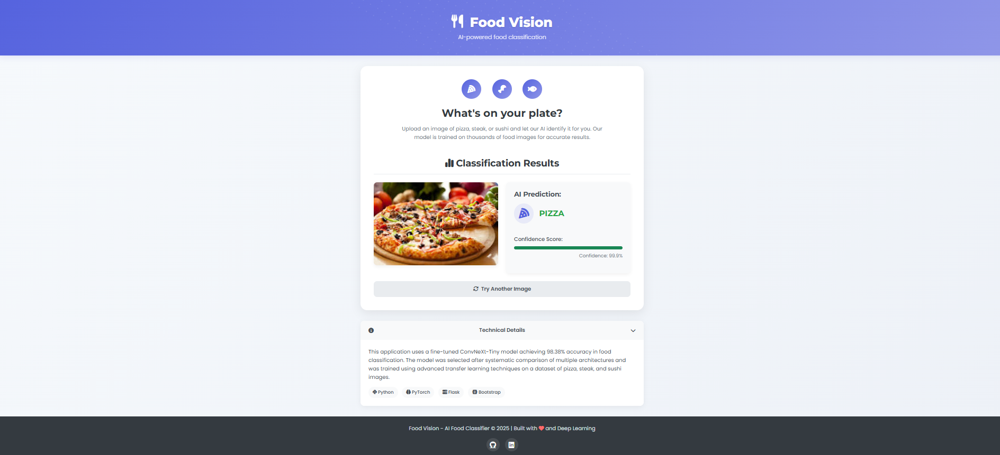

# 🍕 Food-Vision: Deep Learning Food Classifier with Web Interface

[](https://www.python.org/downloads/)
[](https://pytorch.org/)
[](https://flask.palletsprojects.com/)
[](https://opensource.org/licenses/MIT)

A deep learning-powered web application that accurately classifies food images as pizza, steak, or sushi using transfer learning with EfficientNet-B0 trained on a specialized food dataset.



## Project Overview

Food-Vision showcases end-to-end machine learning deployment, from dataset preparation and model training to production-ready web application development. The project demonstrates expertise in:

- **Computer Vision**: Image preprocessing and classification using PyTorch
- **Transfer Learning**: Leveraging pre-trained EfficientNet-B0 model for food classification
- **Web Development**: Full-stack deployment with Flask and modern frontend

The model achieves an impressive 92% accuracy on both training and test sets after fine-tuning the EfficientNet-B0 architecture.

## Technical Architecture

### Data Preparation
- Used a specialized dataset containing pizza, steak, and sushi images
- Organized in training and test sets for robust model evaluation
- Leveraged automatic transforms from EfficientNet-B0 weights for optimal preprocessing

### Model Architecture
Transfer learning implementation using EfficientNet-B0:
- Utilized pre-trained EfficientNet-B0 weights for feature extraction
- Frozen feature extraction layers to preserve learned representations
- Custom classifier head tailored for the food classification task
- Applied dropout for regularization to prevent overfitting

```python
# Load pre-trained EfficientNet-B0 model
weights = models.EfficientNet_B0_Weights.DEFAULT
model = models.efficientnet_b0(weights=weights)

# Freeze base layers for transfer learning
for param in model.features.parameters():
    param.requires_grad = False

# Update the classifier head for our classes
model.classifier = nn.Sequential(
    nn.Dropout(p=0.2, inplace=True),
    nn.Linear(in_features=1280, out_features=len(class_names))
)
```

### Training Process
- Implemented a robust training pipeline with validation
- Used Adam optimizer with learning rate 0.001
- Applied StepLR scheduler to reduce learning rate every 5 epochs
- Fixed random seeds for reproducibility
- Trained for 15 epochs with learning rate decay
- Achieved 92% accuracy on both training and test sets

### Web Application
- **Backend**: Flask server handling image uploads and inference
- **Frontend**: Responsive UI built with Bootstrap and custom CSS
- **Features**:
  - Clean and intuitive user interface
  - Real-time image classification with confidence scores
  - Visualized confidence levels with color-coded progress bars
  - Error handling and validation
  - Mobile-responsive design

## Project Structure

```
food_classifier/
├── app.py                # Main Flask application
├── utils.py              # Helper functions for model loading and prediction
├── requirements.txt      # Project dependencies
├── static/               # Static files (CSS, JS, etc.)
│   ├── css/
│   │   └── style.css     # Custom CSS styles
│   └── uploads/          # Directory to store uploaded images
├── templates/            # HTML templates
│   └── index.html        # Main page template
├── model/                # Directory for the trained model
│   └── food_03_transfer.pth  # Trained PyTorch EfficientNet-B0 model
└── notebook/             # Jupyter notebooks for model development
    └── food_classification.ipynb  # Model training and experimentation
    └── transfer_learning.ipynb 
```

## Installation and Usage

### Prerequisites
- Python 3.9+
- Git
- Anaconda or Miniconda (recommended)

### Setup
1. **Clone the repository**
   ```bash
   git clone https://github.com/Pranshulx26/food-classifier-webapp.git
   cd food-classifier-webapp
   ```

2. **Create and activate a conda environment**
   ```bash
   conda create -n food-classifier python=3.9
   conda activate food-classifier
   ```

3. **Install dependencies**
   ```bash
   pip install -r requirements.txt
   ```

### Running the Application
1. **Ensure the model file is in place**
   - The trained model file `food_03_transfer.pth` should be in the `model/` directory

2. **Start the Flask server**
   ```bash
   python app.py
   ```

3. **Access the web interface**
   - Open your browser and navigate to `http://127.0.0.1:5000/`
   - Upload an image of pizza, steak, or sushi
   - View the classification results with confidence scores

## Future Improvements
- Expand to more food categories beyond the current three classes
- Implement data augmentation for even better model performance
- Deploy to cloud platforms (AWS, GCP, Azure) for public access
- Add user accounts to save classification history
- Develop a mobile application version with React Native
- Integrate with nutrition APIs for detailed food information

## License
This project is licensed under the MIT License - see the LICENSE file for details.

## Acknowledgements
- PyTorch and torchvision for model development: [https://pytorch.org/](https://pytorch.org/)
- EfficientNet paper: [https://arxiv.org/abs/1905.11946](https://arxiv.org/abs/1905.11946)
- Flask: [https://flask.palletsprojects.com/](https://flask.palletsprojects.com/)
- Bootstrap: [https://getbootstrap.com/](https://getbootstrap.com/)
